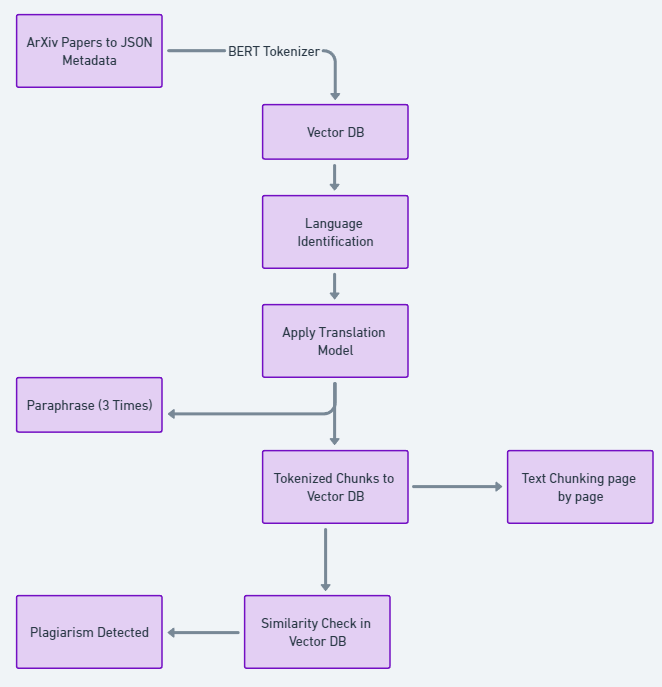

## Plagiarism Detection
Plagiarists rely on paraphrasing content without changing the key concepts. Concept paraphrasing can be detected along with the type of anatomy of the paraphrase types. 

Languages Supported - French, German, Greek, Russian, Japanese
Tokenizer used - `bert-base-uncased`
Translation and Paraphrase models - `Helsinki-NLP/opus-mt-{text_lang}-{target_lang}` , `Vamsi/T5_Paraphrase_Paws`

1GB sample data of Arxiv papers from Kaggle from various languages were used in the vector DB. Further tried implementing a PEFT adapter on LLama for Paraphrase anatomy detection (ex -Coordination Changes, Ellipsis, Negation switching, etc.)

`pip install -r req.txt`

`streamlit app.py`

